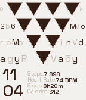

# PyramidWatch

**A Pebble Time Steel (Basalt) watchface by [Manaksu](https://manaksuwebsite.vercel.app)**



An original watchface concept built around geometry and typography. Ten inverted equilateral triangles form a pyramid — each triangle represents 10% battery, draining from the tip upward. The surrounding space fills with alphanumeric noise, with the date hidden inside it. Time and health stats anchor the bottom.

> **This concept is original.** An inverted triangle pyramid as a battery indicator, combined with typographic noise wrapping around geometry, does not exist on any other watchface platform as of May 2026.

---

## Two layout modes

### Standard
Full-width pyramid. Date chars fill the gaps on either side — left = day+month, right = weekday — highlighted in noise. Uniform or scaled font (chars grow larger toward the bottom as gaps widen).

### Wrap
Smaller pyramid positioned at left, center, or right. Date text fills the entire canvas — above, below, and on both sides — wrapping flush against the actual triangle silhouette per pixel row. Small or large char font.

---

## Bottom section (both modes)
- Left: `HH` / `MM` stacked, Space Grotesk Medium
- Right of time: 4 live health stats, label muted + value highlighted

---

## Settings

| Setting | Options |
|---|---|
| Background | ePaper Cream / Black / White |
| Layout mode | Standard / Wrap |
| Pyramid position | Left / Center / Right *(wrap mode)* |
| Wrap text size | Small / Large *(wrap mode)* |
| Date font style | Uniform / Scaled *(standard mode)* |
| Stat label style | Short (STP/HR/SL/CAL) / Full (Steps/Heart Rate/Sleep/Calories) |
| Stat 1–4 | Steps, Heart Rate, Sleep, Calories, Distance |

All settings persist across restarts. Date band regenerates each hour via seeded PRNG.

---

## CloudPebble setup

1. **Create Project → Import → Import from ZIP**
2. **Settings → App Message Keys** — add all:

| Key | Value |
|---|---|
| BG_CHOICE | 0 |
| STAT_STYLE | 1 |
| STAT_1 | 2 |
| STAT_2 | 3 |
| STAT_3 | 4 |
| STAT_4 | 5 |
| DATE_STYLE | 6 |
| LAYOUT_MODE | 7 |
| PYR_POS | 8 |
| WRAP_FONT | 9 |

3. **Resources** — two fonts in `resources/fonts/`:
   - `SpaceGrotesk-Medium.ttf` → name `FONT_SG_MEDIUM_28`, characterRegex `[0-9]`
   - `SpaceGrotesk-Regular.ttf` → name `FONT_SG_REGULAR_10`, characterRegex `[0-9A-Za-z :./]`

4. Ensure `appinfo.json` has `"capabilities": ["configurable", "health"]`

---

## Pixel budget

```
Screen:   144 × 168px
PYR_OY=4  PYR_H=103  TIP_Y=107  BOT_H=61
Time:     2 × 27px = 54px  (sz=28, fits in 61px)
Stats:    4 × 10px + 3×2px gaps = 46px  (sz=10, side-by-side with time)

Wrap pyramid:  S=14  PYR_WW=65  PYR_HW=57  PYR_TOP=25
```

---

## File structure

```
src/
  main.c                — watchface C code (~530 lines)
  js/
    index.js            — PebbleKit JS settings UI (inline data:text/html)
resources/
  fonts/
    SpaceGrotesk-Medium.ttf
    SpaceGrotesk-Regular.ttf
appinfo.json
triangle_battery.c      — saved battery modules (not compiled):
                          Module A: triangle pyramid battery
                          Module B: 5-star vertical column battery
```

---

## License

© 2026 Manaksu. All rights reserved.

The PyramidWatch concept, design, and implementation are original works. You may view and study this code. You may not use, copy, modify, distribute, or create derivative works — commercial or otherwise — without explicit written permission.

---

*Pebble Time Steel · Basalt · SDK 3 · CloudPebble*
